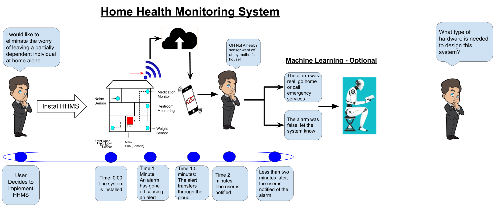
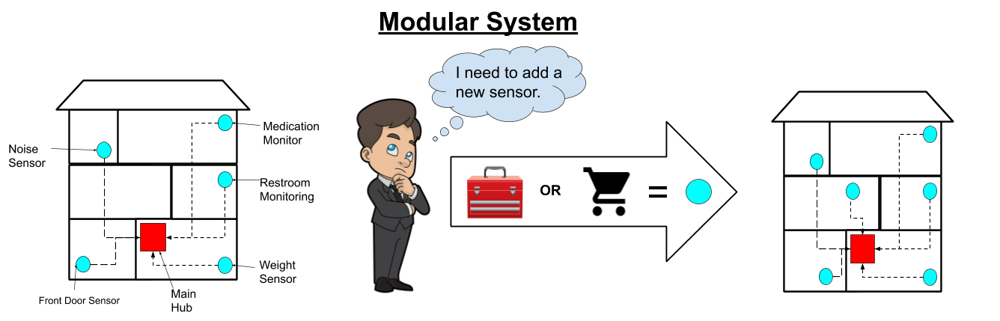

## Introduction

This report will outline and document the design methods and decisions made throughout the entire semester in the first semester of senior design. The project will demonstrate basic knowledge and understanding of both hardware and software systems as well as the capabilities of working in a virtual team environment. The goal of this first semester was to complete the entire design process in order to focus on the implementation next semester so that the group might arrive with a successful final senior design product at graduation. The communication abilities and knowledge of required tool sets were tested and displayed through the semester.  

For the purpose of this project, the semester began with defining the problem: How can one monitor their partially dependent family member while the user is away from their home? Although there are many options that someone could choose to pursue such as a nursing home or a live-in nurse, these can be extremely expensive. Not only does the price of care create a ginormous burden on the family members, the additional factors of Covid-19 now come into play. Family members are now limited to either extremely limited and controlled visiting hours or in some cases visitors are no longer allowed to visit nursing homes to see their loved ones. In a time of desperation and near world-wide terror, being restricted from seeing family members can have a huge impact on the moral in elderly people - this can/could have a direct impact on the persons health.

Like mentioned in the previous paragraph, the competition that comes with monitoring loved ones are in-home nurses, nursing homes, and current in-home “smart” monitoring systems. So why not choose one of these options? To begin: in-home nurses can be extremely expensive, costing up to ninety dollars an hour, and in many cases have minimum hours each day. Over-night and whole day personal care can easily get out of hand when it comes to pricing and in many families, this is not a feasible option. Next, in the United States of America, the average nursing home or assisted living facility can cost upwards of $4,000 a month. Over the course of five years, this will cost the family $240,000.  

So, what is the solution here? Develop a home health monitoring system hub that can connect multiple subsystems to approach different aspects of a client's needs. The system would have the ability for a user to add on any type of subsystem/sensor that they desired as the system would be designed around the concept of modularity. This means that the system would be designed in such a way that the subsystems would be divided into their own independently created systems that will have the ability to be created, modified, replaced, or exchanged with other subsystems. The subsystems added would have the ability to measure everyday aspects of an individual’s health from information like their movement throughout the house to how many times they have used the restroom or even taken a shower. The limits to what aspects of the user's day to day life that is monitored by the home health monitoring system is limited only to the user's imagination – and of course knowledge of hardware.  

To begin with the project, stakeholders as well as the lines that needed to be drawn regarding the scope of the project were discussed. This discussion was then taken and revised to create the problem statement that was used to brainstorm the initial top-level diagram. After multiple revisions, the final diagram can be seen in {+@fig:TLD1} and {+@fig:TLD2} below.

{#fig:TLD1}

{#fig:TLD2}

### Background

### Existing Solutions

## Project Description

In order to address the aforementioned problems, the team proposes an open-source home health monitoring system with an API to encourage extensibility to third-party devices. The system, initialized as **HHMS**, seeks to create and focus on a framework moreover than a single implementation, allowing relatively simple additions to the system without necessitating a recreation of the multi-step communication setups and data processing.

The project thusly focuses on establishing this framework and its API, allowing near any device to integrate with the system given it adheres to the protocols set by the system.

### Sample

While the framework is the main focus, it is dificult to show that a framework exists without a working solution, and indeed multiple. If the system only demonstrated a single communicating device, it would hardly justify or prove the extensibility. Hence several sensor sub-systems will be set-up to work with the framework as an example of its capability and proof-of-concept.

### Capabilities

* **Data Acquisition and Communication**: the user shall be able to read the data from their sensor subsystems, as well as communicate back to them in order to set their properties.
* **Data Processing**: data shall be processed according to set rules in order to indicate discrepencies with expected behavior.

### Machine Learning

In order to further aid the efforts of the caretaker, behavior anomaly recognition should be implemented in order to detect irregular patterns or sharp steps in established patterns. The implementation will allow short-term recognition of emergencies (e.g. falls) as well as unhealthy longer-term patterns (such as a sudden drop in weight over a few days).

## Design Process

After establishing the main [project goals](#capabilities), design began with the overarching view of the project and brainstorming solutions via conceptual block diagrams, as d

To this end, there is already a necessary separation in the software -- data-steams of the connected devices and metadata used by the system to interpret the data-streams -- as well as hardware -- sensor component and system wrapping microcontrollers. Additionally, due to the emphasization on a DIY and simple extensible set-up, user communication through the system is inherent to the design.

After the broad design was established, the individual components and implementation details were established in decision tables using a calculated Figure of Merit  system. These decisions were then processed into the design table that outlines the final component-level decisions. Due to the inexperience of team Engies, this system is crucial in order to determine the proper materials for the project and develop the parts list without merely relying on the limited scope of products introduced in courses.

### Methods

### Decision Tables

The decision tables compile the research into the relevant specifications

### Design Tables

### Input Table

### Output Table

### Timeline

## System Design

### Hardware Design

#### Hardware Simulation

### Software Design

#### Software Simulation

## Cost Analysis

## Individual Tasks

### Ziyad Allehaibi

### Terry Edwards

### Ben Whalin

### Elijah Rose

Elijah focused primarily on the software design aspects of the project, along with the aid of Terry, as detailed in [software simulation](). He additionally contributed various other pieces and work to the team, such as the hardware diagram V1, separating the Data-Acquisition and Processing hub, etc.