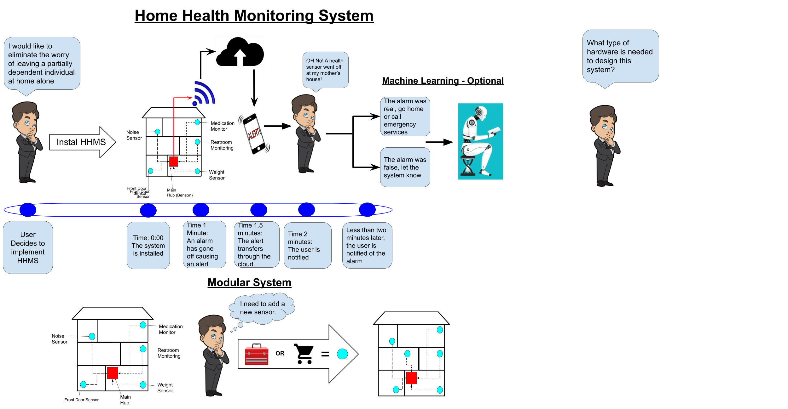
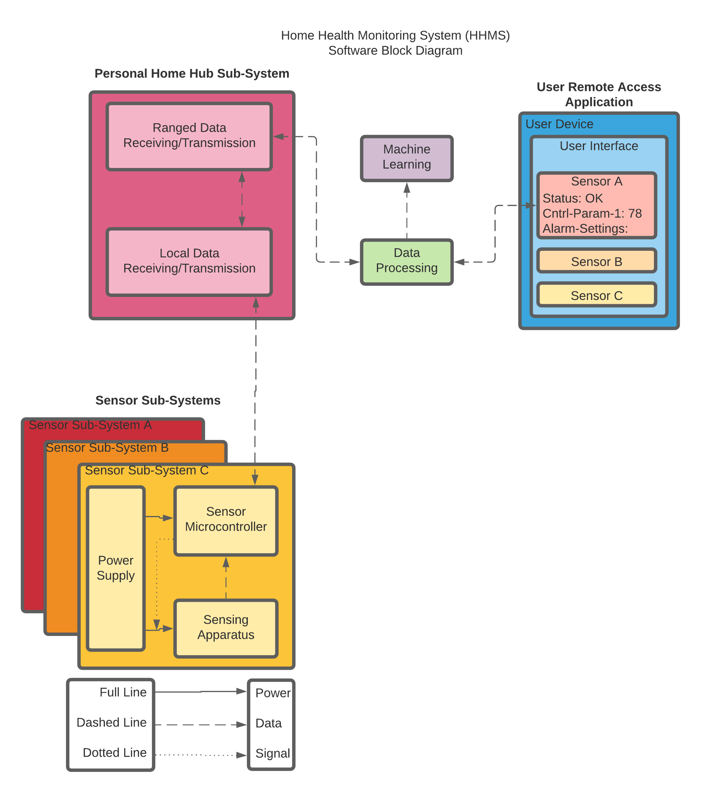
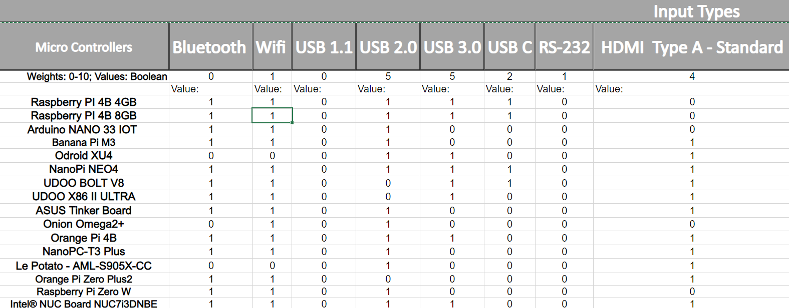
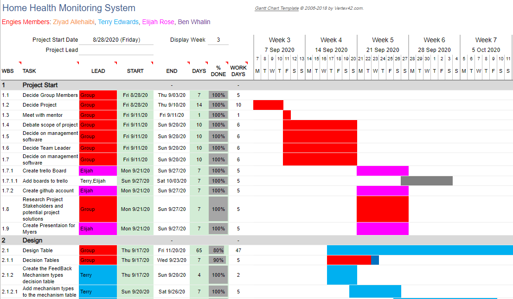
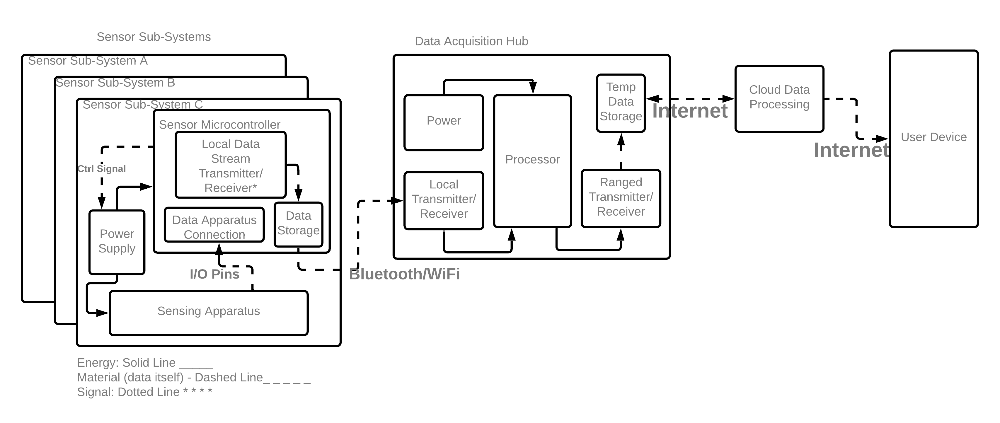
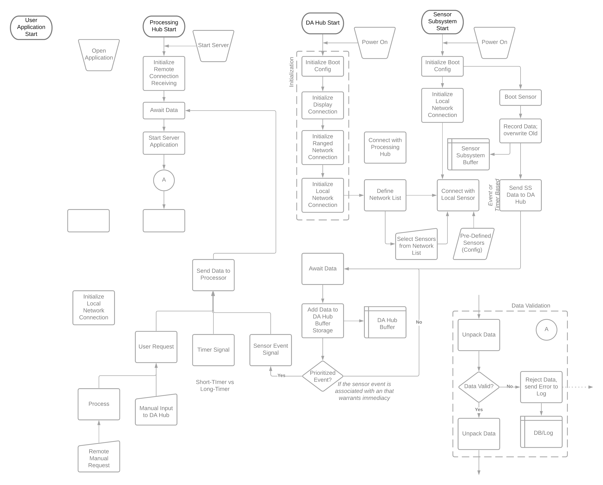

## Introduction

### Background

### Existing Solutions

## Project Description

In order to address the aforementioned problems, the team proposes an open-source home health monitoring system with an API to encourage extensibility to third-party devices. The system, initialized as **HHMS**, seeks to create and focus on a framework moreover than a single implementation, allowing relatively simple additions to the system without necessitating a recreation of the multi-step communication setups and data processing.

The project thusly focuses on establishing this framework and its API, allowing near any device to integrate with the system given it adheres to the protocols set by the system.

### Sample

While the framework is the main focus, it is dificult to show that a framework exists without a working solution, and indeed multiple. If the system only demonstrated a single communicating device, it would hardly justify or prove the extensibility. Hence several sensor sub-systems will be set-up to work with the framework as an example of its capability and proof-of-concept.

### Capabilities

* **Data Acquisition and Communication**: the user shall be able to read the data from their sensor subsystems, as well as communicate back to them in order to set their properties.
* **Data Processing**: data shall be processed according to set rules in order to indicate discrepencies with expected behavior.

### Machine Learning

In order to further aid the efforts of the caretaker, behavior anomaly recognition should be implemented in order to detect irregular patterns or sharp steps in established patterns. The implementation will allow short-term recognition of emergencies (e.g. falls) as well as unhealthy longer-term patterns (such as a sudden drop in weight over a few days).

## Design Process

After establishing the main [project goals](#capabilities), design began with the overarching view of the project and brainstorming solutions via conceptual block diagrams, as d

To this end, there is already a necessary separation in the software -- data-steams of the connected devices and metadata used by the system to interpret the data-streams -- as well as hardware -- sensor component and system wrapping microcontrollers. Additionally, due to the emphasization on a DIY and simple extensible set-up, user communication through the system is inherent to the design.

After the broad design was established, the individual components and implementation details were established in decision tables using a calculated Figure of Merit  system. These decisions were then processed into the design table that outlines the final component-level decisions. Due to the inexperience of team Engies, this system is crucial in order to determine the proper materials for the project and develop the parts list without merely relying on the limited scope of products introduced in courses.

### Methods

### Decision Tables

The decision tables compile the research into the relevant specifications

### Design Tables

### Input Table

### Output Table

### Timeline

## System Design

### Hardware Design

#### Hardware Simulation

### Software Design

#### Software Simulation

## Cost Analysis

## Individual Tasks

### Ziyad Allehaibi

### Terry Edwards

### Ben Whalin

### Elijah Rose

Elijah focused primarily on the software design aspects of the project, along with the aid of Terry, as detailed in [software simulation](). He additionally contributed various other pieces and work to the team, such as the hardware diagram V1, separating the Data-Acquisition and Processing hub, etc.