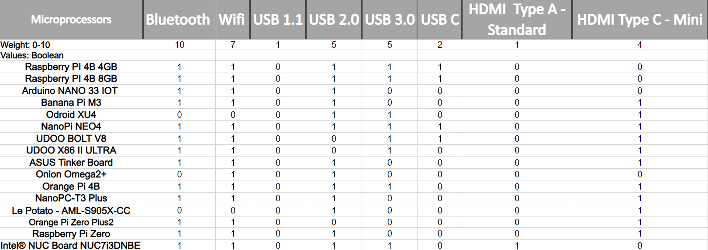

## Introduction


### Background

## Project Description and Goals

## Design Process

### Methods

### Decision Tables

The decision tables compile the research into the relevant specifications





### Design Tables

### Input Table

### Output Table

### Timeline


```{.mermaid width=1800}
gantt
dateFormat MM-DD
axisFormat %m-%d
title Elijah's FA2020 HHMS Tasks - By Subject


section Project Proposal
Email Abi Yildirim about RC Car		: done,		rand,		09-05,		1w
Invite New Member - Ziyad			: done,		rand,		09-05,		1w
Create VR Resist Gloves Proj Prop	: done,		rand,		09-05,		1w
Create Logistic Manage Proj Prop	: done,		rand,		09-05,		1w
Email Abi Yildirim about IR Sensor	: done,		rand,		09-12,		1w
Email Marstander about Ideas		: done,		rand,		09-12,		1w
Discuss Myers' Project Ideas (solo)	: done,		rand,		09-12,		1w
Generate HHMS Potential Solutions	: done,		rand,		09-26,		1w


section Project Tools Setup
Setup Email - Formal Comm.			: done,		email,		09-03,		2d
Setup Discord - General Comm.		: done,		discord, 	09-03,		2d
Setup Trello - Kanban PM			: done,		trello, 	10-03,		1w
Setup GanttTools - Task Planning	: done,		gant, 		10-03,		1w
Setup GitHub - Version History		: done,		github, 	10-03,		1w
YouTube - Video Uploads				: done,		yt,			10-17,		1d


section Presentation
Create Initial Impressions (V1)		: done,		rand,		09-26,		1w
Refine Initial Impressions	(V2)	: done,		rand,		10-03,		1w
Add Poster Methods and Tech			: done,		rand,		10-10,		1w
Add Poster Research Issues			: done,		rand,		10-10,		1w
Add Poster References				: done,		rand,		10-10,		1w
Add Poster Soft & Learn Mat			: done,		rand,		10-10,		1w
Add Poster Hard & Price				: done,		rand,		10-10,		1w
Add Poster Prep & Plan				: done,		rand,		10-10,		1w
Refine Poster Specs					: done,		rand,		10-10,		1w
Refine Poster Soft & Learn Mat		: done,		rand,		10-17,		1w
Refine Poster Prep & Plan			: done,		rand,		10-17,		1w
Refine Various Poster Sections		: done,		rand,		10-24,		1w
Refine Poster References			: done,		rand,		10-31,		1w
Feedback Mech Table					:		    mech,		11-14,		3d
Compatible Programming Languages	:		  	compLangs,	11-14,		2d
Software Flowchart V3				: active, 	flow3,		11-14,		12h
Software Flowchart V4				:         	flow4,		after flow3,	12h
Final Poster						:         	poster,		after flow4,	1d
Final Decision Table				:         	decision,	after ddsp,	1d
Presentation V2						:         	presentation,	after poster decision,	1d


section Diagrams
Create Individual TLD (V1)			: done,		rand,		10-03,		1w
Refine TLD (V2)						: done,		rand,		10-10,		1w
Create Software Block Diagram (V1)	: done,		rand,		10-10,		1w
Refine Project Block Diagram		: done,		rand,		10-10,		1w
Refine Software Block Diagram (V2)	: done,		rand,		10-17,		1w
Create Hardware Diagram	(V1)		: done,		rand,		10-17,		1w
Create Software Flowchart	(V1)	: done,		rand,		10-24,		1w
Create Activity Diagram				: 			rand,		10-24,		1w
Create Sequence Diagram				: 			rand,		10-24,		1w
Create Data Flow Diagram			: 			rand,		10-31,		1w
Refine Software Flowchart (V2)		: done,		rand,		11-07,		1w
Create Software Flowchart (V3)		: done,		rand,		11-07,		1w
Refine Software Flowchart (V4)		: done,		rand,		11-07,		1w


section Decision Table
Table Grabbing						: done,     grab,		11-13,		12h
Data Reading						: active,   read,		after grab,	12h
Decision Linking					:        	link,		after read,	12h
Boolean Decisions					:        	bool,		after link,	12h
Standard Deviation Eqs				:        	devi,		after link,	12h
Simple Weighted Decisions			:        	simp,		after devi,	12h
Comparison Decisions				:        	comp,		after link,	12h
Local Disp							:        	ldsp,		after bool simp comp,	12h
Design Table Disp					:        	ddsp,		after ldsp,	1d


section Research
Research Project Proposals			: done,		rand,		09-05,		1w
Research RC Car	with API Project	: done,		rand,		09-05,		1w
Research Stakeholders				: done,		rand,		09-26,		1w
Research Alternative Solutions		: done,		rand,		09-26,		1w
Research PM Software				: done,		rand,		10-03,		1w
Resarch Software Tools for IoT		: done,		rand,		10-24,		1w
Research Table Formulas				: done,		rand,		10-31,		1w
Research m.Control vs m.Process		: done,		rand,		10-31,		1w
Research Processing Methods			: done,		rand,		10-31,		1w
Research Home Health Automation		: done,		rand,		11-07,		1w


section Miscellaneous
Contract Covid-chan					: done,		rand,		09-19,		1w
Yeet Covid-chan						: done,		rand,		09-19,		1w
Compute Data Storage Needs			: done,		rand,		10-24,		1w
Compute Data Processing Needs		: done,		rand,		10-24,		1w
Decide Comm. Protocols				: done,		rand,		10-31,		1w
Logo-V1								: done,		logo1,		10-31,		1w
Logo-V2								: done,		logo2,		11-28,		1w
```

## System Design

### Hardware Design


#### Hardware Simulation

### Software Design


#### Software Simulation

## Cost Analysis

## Individual Tasks

### Ziyad Allehaibi

### Terry Edwards

### Ben Whalin

### Elijah Rose