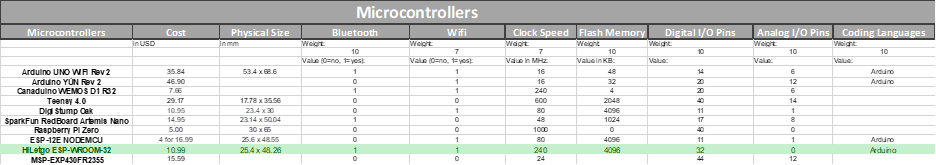
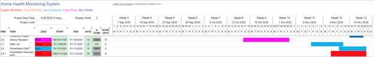
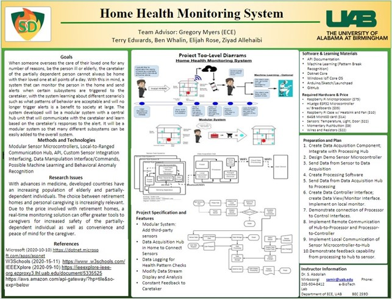

# Introduction

This report will outline and document the design methods and decisions made throughout the entire semester in the first semester of senior design. The project will demonstrate basic knowledge and understanding of both hardware and software systems as well as the capabilities of working in a virtual team environment. The goal of this first semester was to complete the entire design process in order to focus on the implementation next semester so that the group might arrive with a successful final senior design product at graduation. The communication abilities and knowledge of required tool sets were tested and displayed through the semester.  

For the purpose of this project, the semester began with defining the problem: How can one monitor their partially dependent family member while the user is away from their home? Although there are many options that someone could choose to pursue such as a nursing home or a live-in nurse, these can be extremely expensive. Not only does the price of care create a ginormous burden on the family members, the additional factors of Covid-19 now come into play. Family members are now limited to either extremely limited and controlled visiting hours or in some cases visitors are no longer allowed to visit nursing homes to see their loved ones. In a time of desperation and near world-wide terror, being restricted from seeing family members can have a huge impact on the moral in elderly people - this can/could have a direct impact on the persons health.

Like mentioned in the previous paragraph, the competition that comes with monitoring loved ones are in-home nurses, nursing homes, and current in-home “smart” monitoring systems. So why not choose one of these options? To begin: in-home nurses can be extremely expensive, costing up to ninety dollars an hour, and in many cases have minimum hours each day. Over-night and whole day personal care can easily get out of hand when it comes to pricing and in many families, this is not a feasible option. Next, in the United States of America, the average nursing home or assisted living facility can cost upwards of $4,000 a month. Over the course of five years, this will cost the family $240,000.  

So, what is the solution here? Develop a home health monitoring system hub that can connect multiple subsystems to approach different aspects of a client's needs. The system would have the ability for a user to add on any type of subsystem/sensor that they desired as the system would be designed around the concept of modularity. This means that the system would be designed in such a way that the subsystems would be divided into their own independently created systems that will have the ability to be created, modified, replaced, or exchanged with other subsystems. The subsystems added would have the ability to measure everyday aspects of an individual’s health from information like their movement throughout the house to how many times they have used the restroom or even taken a shower. The limits to what aspects of the user's day to day life that is monitored by the home health monitoring system is limited only to the user's imagination – and of course knowledge of hardware.  

To begin with the project, stakeholders as well as the lines that needed to be drawn regarding the scope of the project were discussed. This discussion was then taken and revised to create the problem statement that was used to brainstorm the initial top-level diagram. After multiple revisions, the final diagram can be seen in {+@fig:TLD1} and {+@fig:TLD2} below.

{#fig:TLD1}

{#fig:TLD2}

## Background

## Existing Solutions

# Project Description

In order to address the aforementioned problems, the team proposes an open-source home health monitoring system with an API to encourage extensibility to third-party devices. The system, initialized as **HHMS**, seeks to create and focus on a framework moreover than a single implementation, allowing relatively simple additions to the system without necessitating a recreation of the multi-step communication setups and data processing.

The project thusly focuses on establishing this framework and its API, allowing near any device to integrate with the system given it adheres to the protocols set by the system.

## Sample

While the framework is the main focus, it is dificult to show that a framework exists without a working solution, and indeed multiple. If the system only demonstrated a single communicating device, it would hardly justify or prove the extensibility. Hence several sensor sub-systems will be set-up to work with the framework as an example of its capability and proof-of-concept.

## Capabilities

- **Data Acquisition and Communication**: the user shall be able to read the data from their sensor subsystems, as well as communicate back to them in order to set their properties.
- **Data Processing**: data shall be processed according to set rules in order to indicate discrepencies with expected behavior.

## Machine Learning

In order to further aid the efforts of the caretaker, behavior anomaly recognition should be implemented in order to detect irregular patterns or sharp steps in established patterns. The implementation will allow short-term recognition of emergencies (e.g. falls) as well as unhealthy longer-term patterns (such as a sudden drop in weight over a few days).

## Dictionary

- Partially-Dependent Individual (PD): the stakeholder who will be monitored and cared for by the Caretaker
- Caretaker: a primary stakeholder, uses HHMS to monitor their PDs
- Data-Acquisition Hub (DA or DAH): the component that resides in the user's home to acquire and transmit data (as well as potentially more). Previously synonymous with "Hub" and at times "Microprocessor"
- Sensor Subsystems (SS): a setup that allows communication of sensor data to the DAH. Synonymous in the context of the DAH as a Slave, and at times synonymous with Microcontroller.
  - We additionally need a term that refers to the abstract collection of devices that can be enslaved to the DAH as mapped by software, undecided on this.
  - Do not confuse with sensors, which may comprise the entirety of the SS or be merely a component. The SS wraps the sensor. Likewise, the SS wraps the Microcontroller and/or Microprocessor, which is why it may be inappropriate to call it as such.

# Design Process

After establishing the main [project goals](#capabilities), design began with the overarching view of the project and brainstorming solutions via conceptual block diagrams, as d

To this end, there is already a necessary separation in the software -- data-steams of the connected devices and metadata used by the system to interpret the data-streams -- as well as hardware -- sensor component and system wrapping microcontrollers. Additionally, due to the emphasization on a DIY and simple extensible set-up, user communication through the system is inherent to the design.

After the broad design was established, the individual components and implementation details were established in decision tables using a calculated Figure of Merit [@FOM] system. These decisions were then processed into the design table that outlines the final component-level decisions. Due to the inexperience of team Engies, this system is crucial in order to determine the proper materials for the project and develop the parts list without merely relying on the limited scope of products introduced in courses.

## Methods

## Decision Tables

The decision tables compile the research into the relevant specifications

{#fig:DECT1}

{#fig:DECT2}

## Design Tables

To ease with the design process, a design table was created to document and display each design decision that was made throughout the semester. The table shown below in {+@fig:DEST} shows each decision that was made from the weighted tables as well as the problem statement, approach, and necessary equipment in order to create the home health monitoring system. The design table was then used to create the parts list towards the end of the report.

For each item in the design table a sub table was created to show the decision processes and to choose the best option based on the desired engineering characteristics and weights. Every support table lists each possible option that was found through extensive research and then the engineering characteristics that were chosen to help narrow down the most logical choice.

{#fig:DEST}

Many of the decision tables revolved around the systems hub/controller. The first table that was created to help ease the decision on which microcontroller to implement, the output and input types of each microcontroller were added to the support tables seen below in {+@fig:DAOT} and {+@fig:DAIT}. The given outputs would be needed to connect to the systems data processing controller – meaning the outputs must be compatible with Wi-Fi.

{#fig:DAOT}

{#fig:DAIT}

In both the input and output support tables for the microprocessor above, the Raspberry Pi 4B 8Gb was the obvious answer but before we could be sure that this was the decision that needed to be made for the final design, a support table regarding the speed and power of each microprocessor needed to be created. This table can be seen below in {+@fig:DAST}.

{#fig:DAST}

The next decision that needed to be made regarding the hub/controller can be seen in {+@fig:DACM}. The material the case that will hold the controller needed to be determined. After creating the table and beginning to fill out the engineering characteristics for each option, it was obvious due to the convenience and the extremely low price, that a store-bought case was the best option.

{#fig:DACM}

After choosing the previous decisions found in the support tables above, the amount of temporary data storage for the hub/controller needed to be determined. The reason for the storage is in the situation of a power outage inside the house. In this case the controller of the system would not be able to immediately relay data to the data processor and without a temporary storage, the data would be lost. Thus, the need for onboard storage. The most important part of this table came when determining the amount of storage needed. To do this, guesstimates were made in order to determine file size from each sensor type to then calculate the amount the system would need. The results can be seen below in {+@fig:DABUF}.

{#fig:DABUF}

To continue in the design process, the support tables for the subsystems needed to be created. This consisted of a temporary data storage size and the microcontroller chosen for the design. These two tables can be seen below in {+@fig:SSTYPE} and {+@fig:SSBUF}.  

The microcontroller chosen is the ESP32 board. This board was chosen based on speed and output connection types which consist of both the required Bluetooth and Wi-Fi. The other engineering characteristics that were used to determine the microcontroller decided for this design can be seen in the table below. Another important aspect of the chosen board was the number of input/output analog and digital pins that the board was compatible with.

{#fig:SSTYPE}

To complete the design process for the subsystem’s boards, the Microprocessor support table ({+@fig:SSBUF}) was created to determine the necessary storage types that would be required. Like mentioned above in the controller/hub storage, the data storage would only be needed in emergency situations where power was lost to the sensor. With the calculations made in the hub, the subsystem data size was also chosen.

{#fig:SSBUF}

## Input Table

## Output Table

{#fig:OUTPUT}

The Output Table, shown above in {+@fig:OUTPUT}, for the project is a list of potential tests and their expected results, with the measured results table to be filled in in the next semester for EE499 after extensive testing on the project has been performed. With this output table, the expected tests are to be done involving the data transfer rates, such as transferring data from the system to the hub via Bluetooth or Wi-Fi. To allow for a battery backup, testing for the battery lives for some of the different subsystems will be performed to make sure the battery back-up will be adequate for the project. And for the software aspect of the project, the file sizes of the data logs will be tested, expecting the files stored in the data acquisition hub, or the temporary storage of the subsystem itself in case of a power outage. The data filled in the expected column of the table was gathered by researching common data rate, battery lives, and based on the size of the strings generated for the activity logs, allowing for some overhead in the file size.

## Timeline

To help with the organization of the project, a Gantt Chart for the Fall 2020 semester for EE498 was created. By giving each team member a color as well as a color for group activities, the work of the group can be visually organized and compiled in an easy-to-read manner, showing who’s assigned to the given tasks with each task having a specific timeline in order to complete it. The figures below show the different tasks assigned over the course of the semester to each team member, or the group if need be. [^KanbanStyle]

[^KanbanStyle]:
	A Kanban-style project organization and task management structure was attempted as well via *Trello*.

	{width=50%}
  
	However, due to the EE498 requirements, the project was switched to Gantt-style task management.

{#fig:GANTTINIT}

{#fig:GANTTDES1}

{#fig:GANTTDES2}

{#fig:GANTTDES3}

{#fig:GANTTDES4}

{#fig:GANTTDES5}

{#fig:GANTTDES6}

{#fig:GANTTDES7}

The project began in August 2020 towards the beginning of EE498 and the project will conclude in April of 2021 in EE499. Throughout the Fall 2020 semester, the project was selected, researched, and designed with each member of the group given certain tasks to complete, with group members helping each other out to try and complete the various tasks on time if need be. The implementation of the project’s design will begin in the Spring 2021 semester beginning at the end of January.

## Subsystem Analysis

# System Design

The following sections of show the respective hardware and software systems’ designs, with the software simulations presented to give an idea of the look of the software aspect of the project. The hardware design will show the designs of the various hardware components of the project and the software design shows the expected flow of the project, that being the starting of the system and going through the ways the data is gathered and processed.

## Hardware Design

The design of the hardware components hasn’t been finalized for the project yet. While the specific components have all been decided upon, a concrete design for the entire system hasn’t been decided upon. Though a final design will be decided upon and implemented in the Spring 2021 semester. While the design of the entire system is important, the software aspects of the system are more the focal point of the project since the project features a modular design, it’s hardware design is more fluid and less concrete than other projects.

### Sensor Subsystem Analysis

Each of the sensor subsystems consists of the Microcontroller, the power supply, and the sensing apparatus. The sensing apparatus is connected to the microcontroller via the GPIO pins on the microcontroller, with the microcontroller collected the data from the sensor and sending it via either Bluetooth or Wi-Fi to the Data Acquisition Hub to be logged in the storage for the Microprocessor and then transmitted and processed via the cloud to then be received by the user on their device.

### Hardware Simulation

## Software Design

The separation of several of the components necessitates at the minimum three separate software components: the sensor subsystems, the user's input/output of the system, and the intermediary communication and processing. Additionally, in order to better separate roles and allow the possibility of remote processing, the intermediary is further separated into a data-acquisition and processing component -- theoretically, these could be separate program running simultaneously on the same device or two separate systems entirely, the software shall not be the limiting factor in this regard.

{*@fig:SOFTBLOCK} outlines the four major components of the software.

{#fig:SOFTBLOCK}

{#fig:SOFTINT}

{#fig:SOFTFLOW}

### Software Simulation

# Cost Analysis

The budget that was given in senior design consisted of $200 per group member. This amounted to $800 for the entire project. Due to one of the goals of our design being that it would be affordable, the team desired to not use the entire budget for the baseline of our product. This meant that throughout the semester we kept this idea in mind and chose hardware options based off reliability and dependability and not price. At the end of the design, the total cost of the hub/controller alone came out to be $106.94 while the cost of the subsystem sensor package which includes six sensor systems, and a wearable watch came out to be $253.24. Combined, this makes our entire product $360.18, more than half of our budget.  

Due to one of our team members being overseas for the semester and the fact that we are supposed to be social distancing, we opted in spending the remainder of our budget on purchasing extra subsystems and hub/controllers in order for each group member to be able to experiment and aide the process of implementing our design next semester. After figuring out the amount of subsystems and hubs that we could order while staying under our budget, we came to a price of $787.09. This price includes sixteen sensor subsystems and three sets of the hub/controller. The two sub parts tables and the total parts table can all be seen below.  

# Individual Tasks

## Ziyad Allehaibi

My main task for EE498 is enhancing team analysis by finding articles and studies on potential solutions for elderly's conditions. To some degree, the project is based on the assumptions of the existing state of affairs. Also, I looked at various types of sensors that would help to develop the subsystem along with the research of the Microprocessor. I worked on the Gantt chart to lay out all the team activities for this semester and the next one and to describe the work of each member. Over the course of the semester, I participated in working on the Design Table and the Decision Tables needed to assist with the project. In addition, I contributed to the PowerPoint Presentation by developing the slides used for the Current Competition, the Sensors Sub-Table, and the Gantt chart, as well as helping to look at everyone's slides to assist with suggestions and proofreading. 

## Terry Edwards

Excluding the work put into this document, my tasks for this semester (After the project was chosen and researched) consisted of creating the initial rough draft sketch of the top-level design image used in the design poster. This sketch was later recreated in google drawing before updated and improved upon by other group members. After the initial problem statement was decided on, the possible subsystems needed to be brainstormed. To do this I created the subsystems table and added the different things that could be possibly done regarding monitoring a loved one. To fill out this table, I interviewed multiple nurses and a respiratory therapist to get their opinion on aspects of the subsystems that I could not think of. After compiling all the findings and my own personal ideas, a table of roughly sixty different subsystems was created. This table was then broken down and colorized based on the type of physical sensor that could be used in each subsystem. After researching sensor types, I broke the original subsystem table up into the ten sensor types that we have today and then compiled and categorized the different subsystems that were brainstormed and displayed them in a new table. This table was then used to create a weighted decision table based on the chosen engineering characteristics to determine the subsystems that would be implemented into the final design. Alongside the work with the subsystems table, I also aided creating and filling out the design table. This consisted of making many decision tables that required individual engineering characteristics and weights. After completing the decision tables I then compiled all the results into the design table used in our presentation. Next, I took the design table and the subsystem table and created the parts list. I researched parts options to make sure there were no cheaper options and then added them to the parts list. To determine the best combination of parts amongst the group, I split the parts list into multiple tables that showed individual prices for the hub itself and a set of subsystem sensors. Afterwards I combined the two to create the current parts list. I then created the output table used in the presentation. I filled out the initial contents of the table and another student later added on to these. I also recreated the Gantt chart after the initial one made by another student was corrupted and no longer functioned. This consisted of going through the entire semester and deciding on potential tasks that would be necessary to produce our product. Finally, I created the initial copy of the presentation that was used while the other students came behind me and added their individual slides

## Ben Whalin

My tasks for the first semester one (EE498) included researching the potential Microcontrollers and Microprocessors that would be looked at and considered for use in the project. Throughout the semester, I helped work on the Design Table as well as the Decision Tables needed to help with the project. I created the Top-Level Diagram (TLD) used for the poster for the course as well as the Hardware Diagram that will be useful for helping create the project in EE499. I contributed to the PowerPoint Presentation by creating the slides used for the TLD, Hardware Diagram and the Poster as well as helping look over everyone’s slides to help with ideas and proof-reading.  

## Elijah Rose

Elijah focused primarily on the software design aspects of the project, along with the aid of Terry, as detailed in [software simulation](#software-design). He additionally contributed various other pieces and work to the team, such as the hardware diagram V1, separating the Data-Acquisition and Processing hub, etc.

\newpage

# Appendix

## Appendix A: Poster

## Appendix B: Final Slides

\includepdf[pages={-},nup=4x7,pagecommand={},width=5cm,linktodoc=true]{./Resources/Presentation.pdf}
